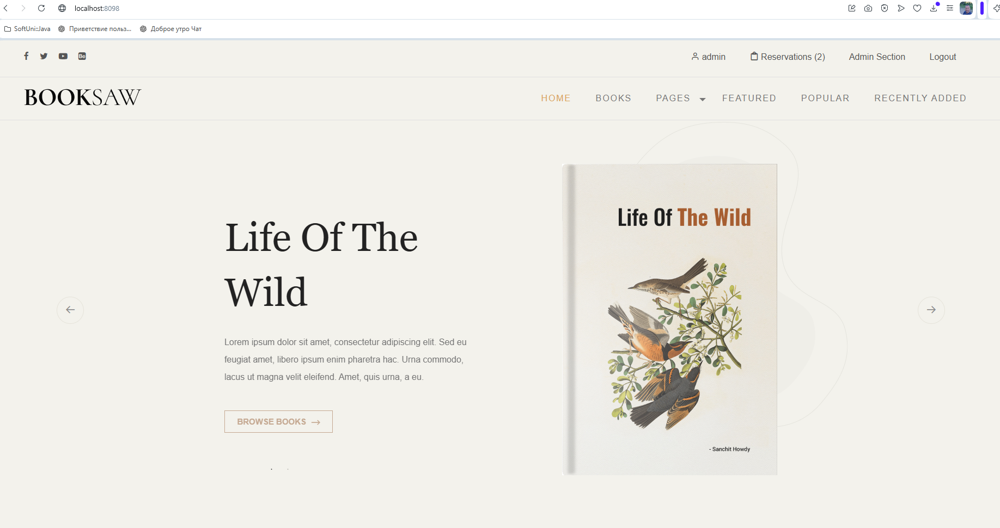
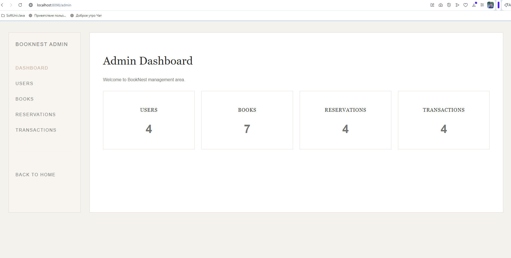

# BookNest

BookNest is an online book reservation platform built with Spring Boot and Thymeleaf as part of the SoftUni Spring Fundamentals course.

The application allows users to browse books, reserve books, manage personal reservations, and provides an administration area for managing users, books, reservations, and transactions.

## Repository

https://github.com/asidorov72/spring-fundamentals-exam

---

## Application Entry Points

### Home Page

http://localhost:8098

### Administration Area

http://localhost:8098/admin

---

## Screenshots

### Home Page

### Admin Dashboard

---

## Features

### Authentication & Authorization

* User Registration
* User Login
* User Logout
* Profile Editing
* Role-Based Access Control (USER / ADMIN)

### Book Management

* Browse Books
* Book Details Page
* Search Books
* Create Book
* Edit Book
* Delete Book

### Reservations

* Reserve Books
* View Personal Reservations
* Duplicate Reservation Prevention
* Reservation History

### Transactions

* Automatic Transaction Creation
* Transaction Monitoring
* Read-Only Transaction Records

### Administration

* Dashboard Statistics
* User Management
* Book Management
* Reservation Management
* Transaction Monitoring

### Contact Module

* Contact Form
* Email Delivery via Mailtrap

---

## Technology Stack

### Backend

* Java 17
* Spring Boot 3.4.0
* Spring MVC
* Spring Data JPA
* Hibernate
* Bean Validation

### Frontend

* Thymeleaf
* Bootstrap 5
* Booksaw Template

### Database

* MySQL

### Testing

* JUnit 5
* Mockito

### Build Tool

* Maven

---

## Business Rules

* Only ACTIVE books can be reserved.
* Multiple users can reserve the same book.
* The same user cannot reserve the same book more than once.
* Every reservation automatically creates a transaction.
* Transactions are used to simulate payments and provide audit history.
* Transaction records are read-only.

---

## Test Accounts

### Administrator

admin / admin123

### User

user / user123

---

## Automated Tests

Implemented unit tests for:

* BookService
* ReservationService

Current test coverage includes:

* Book Search
* Book Retrieval
* Book Creation
* Book Update
* Reservation Creation
* Reservation Validation
* Duplicate Reservation Prevention
* Transaction Creation

**10 unit tests passing.**

---

## Project Structure

### Main Entities

* User
* Book
* Reservation
* Transaction

### User Roles

* USER
* ADMIN

---

## Project Status

Project completed as part of the SoftUni Spring Fundamentals course.

Implemented:

* Authentication & Authorization
* User Management
* Book Management
* Reservations
* Transactions
* Administration Area
* Dashboard Statistics
* Contact Form
* Mailtrap Integration
* Book Search
* Book Details
* My Reservations
* Unit Tests

**Status: Completed and Fully Functional**
